<h2 align="center">Membangun DNS Authoritative Server Menggunakan PowerDNS - Webinar SysAdmin</h2>

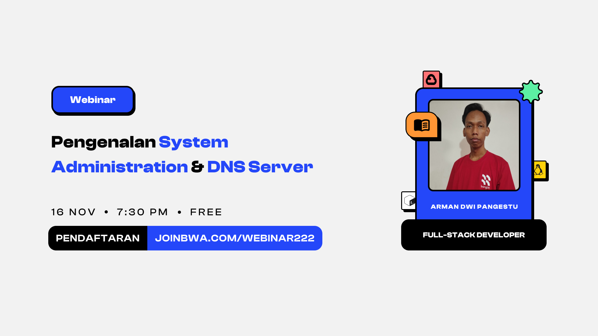

<p align="center">Repository ini adalah panduan untuk membangun DNS Authoritative Server menggunakan PowerDNS pada Webinar SysAdmin yang diadakan pada tanggal 30 bulan November tahun 2024.</p>

## Daftar Isi

-   [Instalasi PowerDNS di Ubuntu Server](#instalasi-powerdns-di-ubuntu-server)
    -   [Langkah 1: Install dan Konfigurasi MariaDB Server](#langkah-1-install-dan-konfigurasi-mariadb-server)
    -   [Langkah 2: Install PowerDNS](#langkah-2-install-powerdns)
    -   [Langkah 3: Konfigurasi PowerDNS](#langkah-3-konfigurasi-powerdns)
    -   [Langkah 4: Membuat DNS Zone dan Record](#langkah-4-membuat-dns-zone-dan-record)
    -   [Langkah 5: Mengubah Child Nameservers & Update Nameserver di Panel Hosting](#langkah-5-mengubah-child-nameservers--update-nameserver-di-panel-hosting)
    -   [Langkah 6: Test Webserver](#langkah-6-test-webserver)

## Instalasi PowerDNS di Ubuntu Server

Ikuti langkah dibawah ini untuk proses instalasi dan konfigurasi `PowerDNS` dengan `MySQL` atau `MariaDB` sebagai `backend` database.

### Langkah 1: Install dan Konfigurasi MariaDB Server

-   Update dan Upgrade sistem package:

```bash
sudo apt update && sudo apt upgrade
```

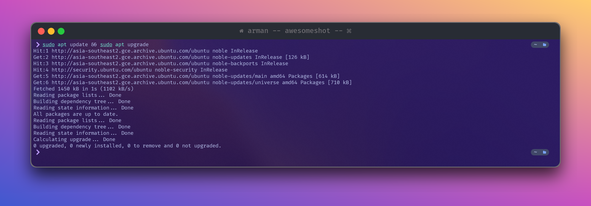

-   Install MariaDB Server dan Client:

```bash
sudo apt install mariadb-server mariadb-client
```

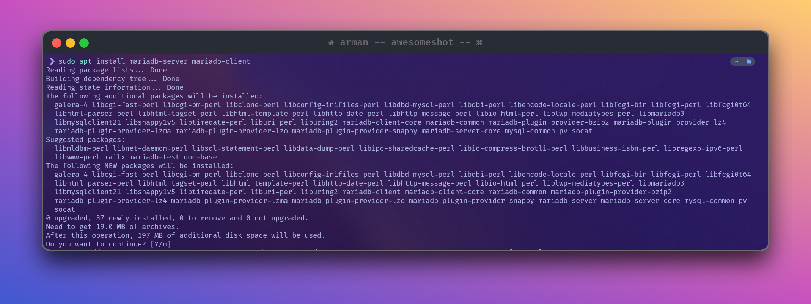

-   Membuat database untuk powerdns di MariaDB

```bash
sudo mysql -u root -p
```

```sql
CREATE DATABASE `powerdns` CHARACTER SET utf8mb4 COLLATE utf8mb4_unicode_ci;
```

-   Membuat akun atau user untuk powerdns kemudian berikan akses ke database `powerdns`

```sql
GRANT ALL PRIVILEGES ON `powerdns`.* TO 'powerdnsuser'@'localhost' IDENTIFIED BY 'YOUR_PASSWORD_HERE';
```


### Langkah 2: Install PowerDNS

-   Menontaktifkan service systemd-resolved karena akan bentrok dengan PowerDNS nantinya

```bash
sudo systemctl disable --now systemd-resolved
```

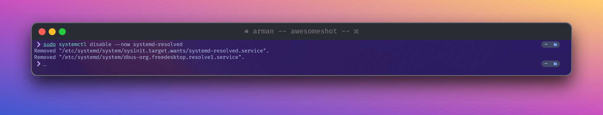

-   Menghapus file konfigurasi system service

```bash
sudo rm -rf /etc/resolv.conf
```

-   Membuat file `/etc/resolv.conf` baru dengan nameserver atau DNS Google

```bash
sudo echo "nameserver 8.8.8.8" | sudo tee /etc/resolv.conf
```

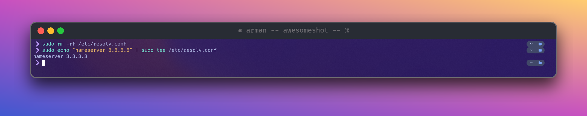

-   Install package PowerDNS Server dan PowerDNS Database Backend

```bash
sudo apt-get install pdns-server pdns-backend-mysql -y
```

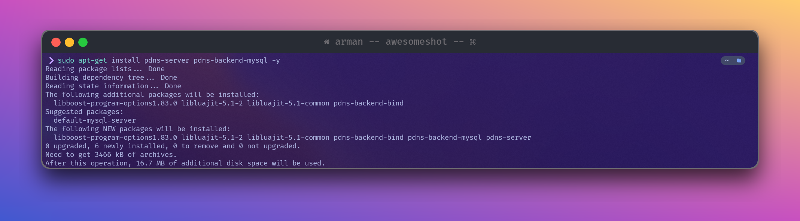

-   Membuat skema database dari bawaan PowerDNS

```bash
sudo mysql -u root -p powerdns < /usr/share/doc/pdns-backend-mysql/schema.mysql.sql
```

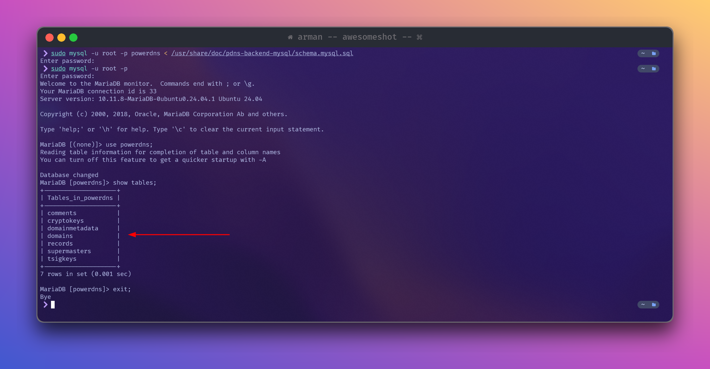

### Langkah 3: Konfigurasi PowerDNS

Melakukan konfigurasi file lokal PowerDNS agar konek ke dalam Database

-   Backup file konfigurasi origin powerdns

```bash
sudo mv /etc/powerdns/pdns.conf /etc/powerdns/pdns.conf.orig
```

-   Membuka file konfigurasi untuk mengedit

```bash
sudo vim /etc/powerdns/pdns.conf
```

```bash
# MySQL Configuration
launch=gmysql
gmysql-host=127.0.0.1
gmysql-port=3306
gmysql-dbname=powerdns
gmysql-user=powerdnsuser
gmysql-password=secretpassword
gmysql-dnssec=yes

local-address=0.0.0.0
local-port=53

# API
api=yes
api-key=c2dd627dd641d517e1f455ca85eccd9b2bd75b6fbfb807fd69ba14a8c90e197c

# Webserver
webserver=yes
webserver-address=0.0.0.0
webserver-port=8081
webserver-allow-from=0.0.0.0/0
webserver-password=secretpassword
webserver-loglevel=none

daemon=yes
guardian=yes
default-soa-content=ns1.devnull.my.id your-name.devnull.my.id 0 3600 600 1209600 3600
log-dns-details=yes
log-dns-queries=yes
loglevel=5
setgid=pdns
setuid=pdns
distributor-threads=4
receiver-threads=3
signing-threads=4
```

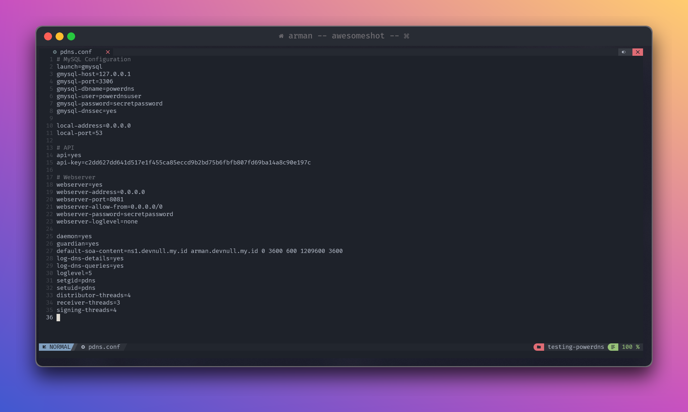

-   Menonaktifkan service `pdns`

```bash
sudo systemctl stop pdns
```

-   Tes koneksi ke database

> [!NOTE]
> Pastikan bahwa powerdns berhasil melakukan koneksi ke dalam database
>
> ```bash
> gmysql Connection successful. Connected to database 'powerdns' on '127.0.0.1'.
> ```

```bash
sudo pdns_server --daemon=no --guardian=no --loglevel=9
```

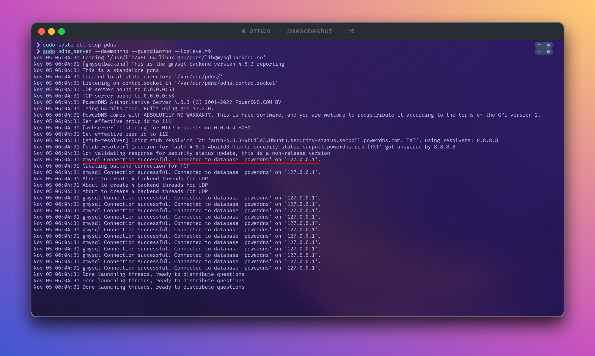

-   Menjalankan service powerdns

```bash
sudo systemctl start pdns
```

-   Mengecek koneksi `pdns` dengan package `ss` atau `Socket Statistics`

> [!IMPORTANT]
> Pastikan bahwa `powerdns` berhasil bejalan pada protocol `tcp` dan `udp` dengan state `UNCONN` dan `LISTEN` di port `53` dan `8081`

```bash
sudo ss -alnp4 | grep pdns
```

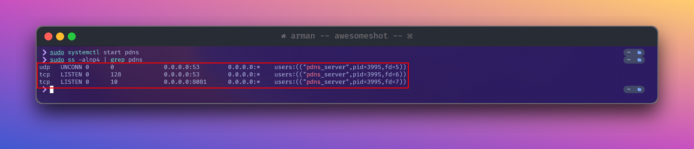

### Langkah 4: Membuat DNS Zone dan Record

-   Membuat DNS zone baru

```bash
pdnsutil create-zone devnull.my.id
```

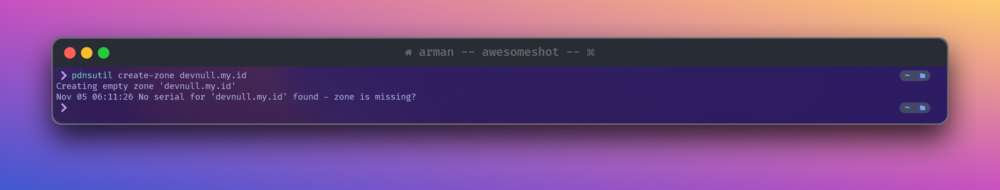

-   Menambahkan record pada zone yang baru dibuat

```bash
pdnsutil edit-zone devnull.my.id
```

```bash
devnull.my.id   3600    IN      SOA     ns1.devnull.my.id your-name.devnull.my.id 1 10800 3600 604800 3600
devnull.my.id   86400   IN      NS      ns1.devnull.my.id.
devnull.my.id   86400   IN      NS      ns2.devnull.my.id.
devnull.my.id   3600    IN      A       34.101.90.211
ns1.devnull.my.id       172800  IN      A       34.101.90.211
ns2.devnull.my.id       172800  IN      A       34.101.90.211
```

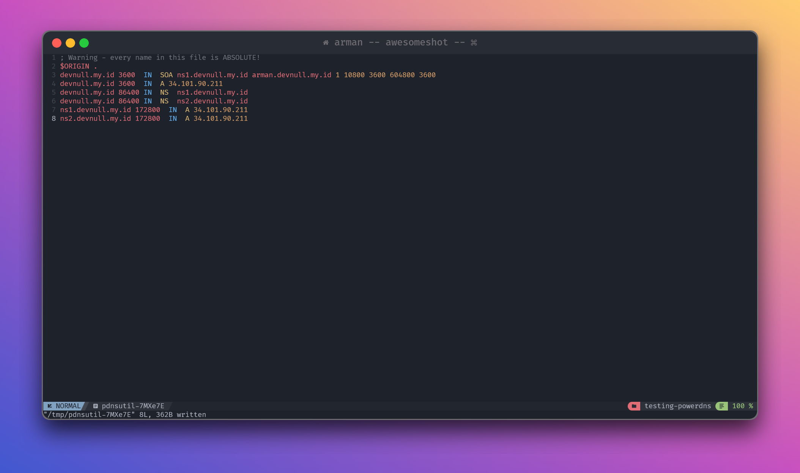

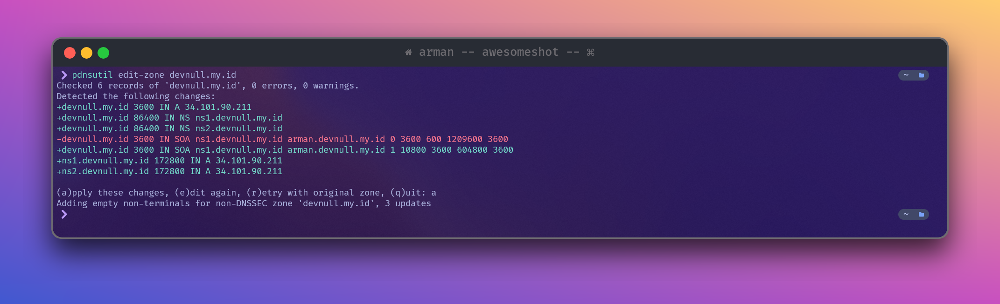

### Langkah 5: Mengubah Child Nameservers & Update Nameserver di Panel Hosting

-   Mengubah Child Nameservers

Untuk melakukannya kalian bisa pergi ke menu `Child Nameserver` melalui registrat domain yang kalian beli. Masing-masing custom nameserver tersebut diarahkan atau di pointing ke IP Public VPS.

> [!NOTE]
> Biasanya `ns2` di pointing sebagai backup nameserver atau biasa disebut slave/secondary

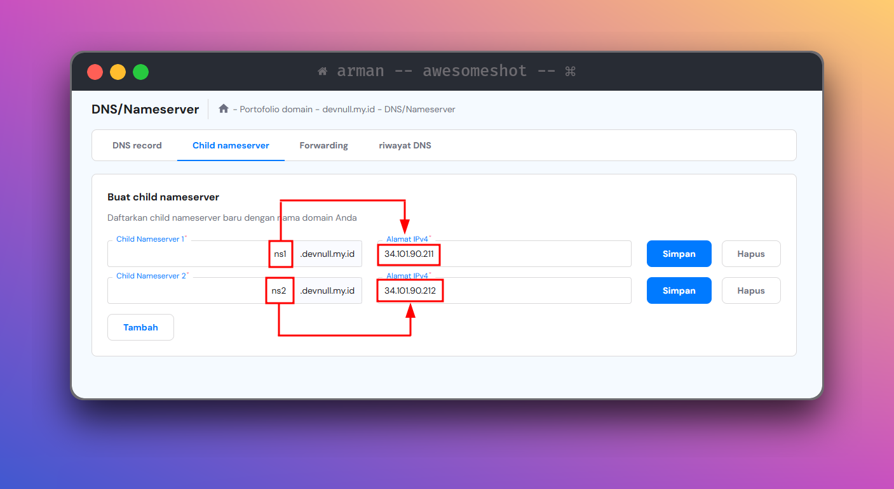

-   Mengupadte Nameserver

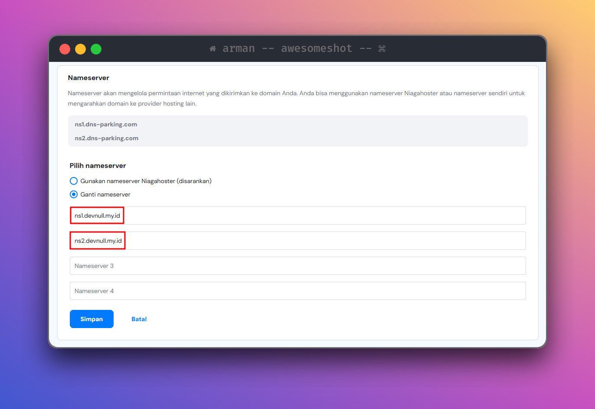

> [!NOTE]
> Biasanya perubahan `Nameserver` membutuhkan waktu beberapa waktu agar diperbarui secara total atau biasa disebut `DNS Propagation`
>
> 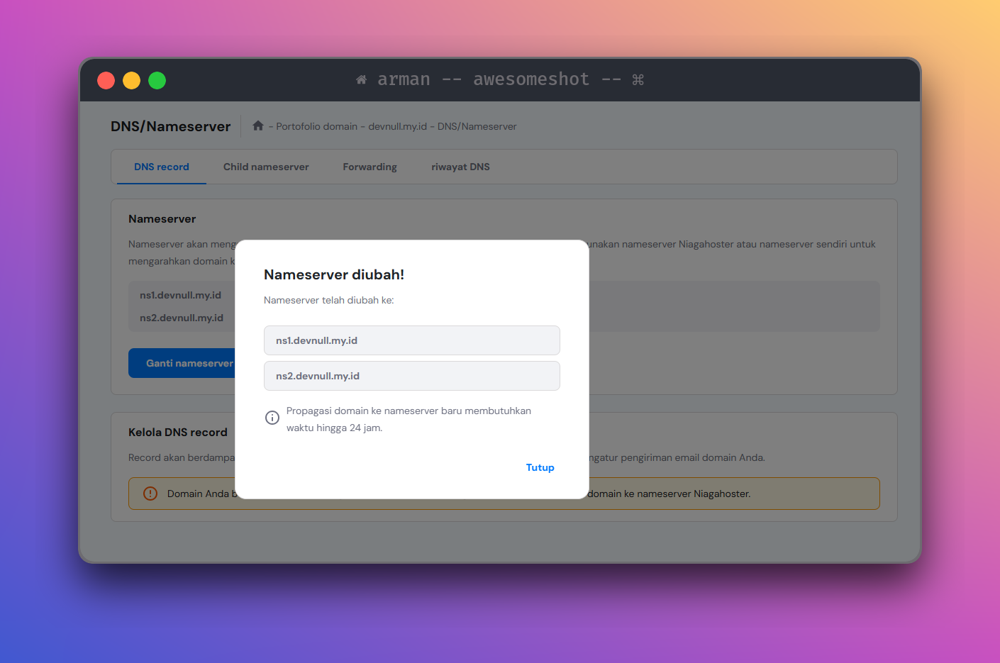
>
> Jika `DNS Propagation` sudah selesai, kalian bisa lakukan cek menggunakan tools `dig` dengan melakukan query dari dns server google seperti
> gambar dibawah ini
>
> 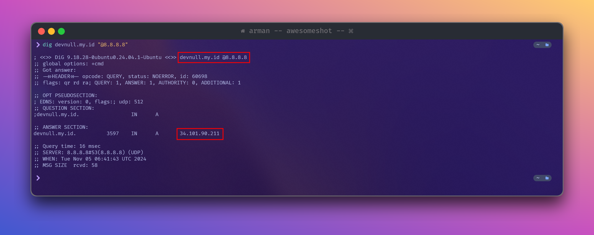

### Langkah 6: Test Webserver

Jika kalian ingin melakukan test apakah domain sudah berhasil di pointing dan dipindahkan nameserver nya ke authoritative server sendiri, kalian bisa coba
jalankan service webserver seperti `Nginx` lalu akses service tersebut melalui domain seperti gambar dibawah ini

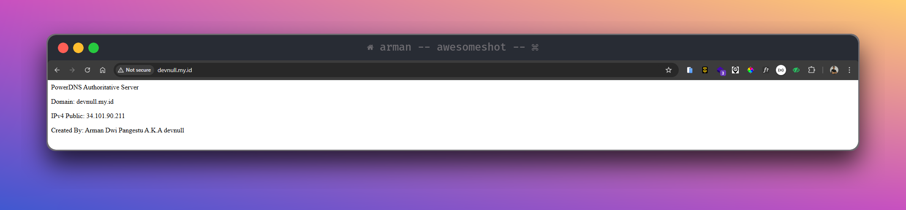
